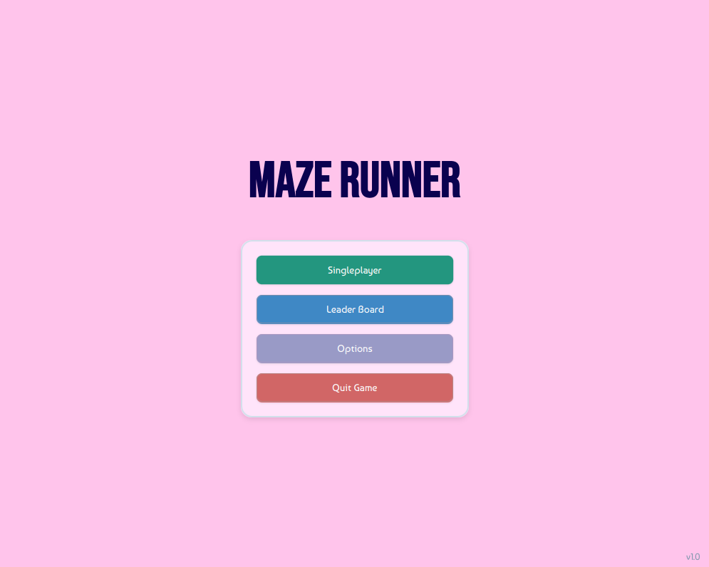
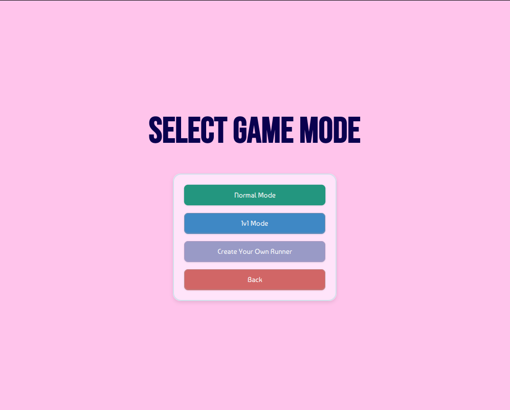
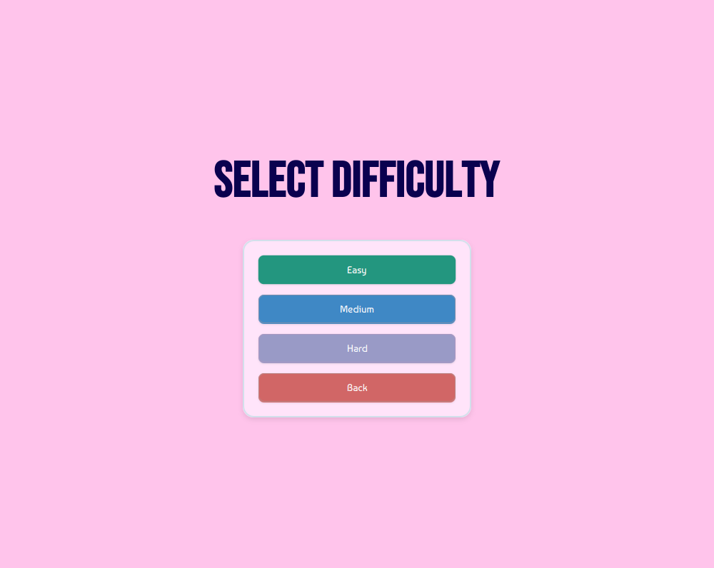
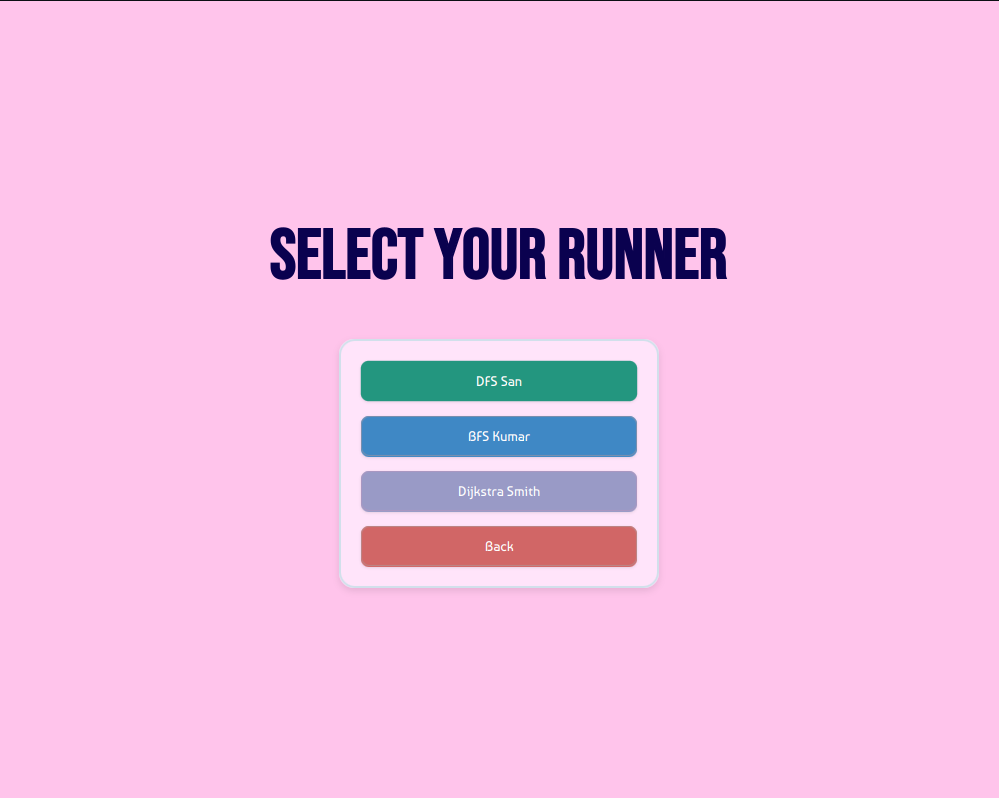
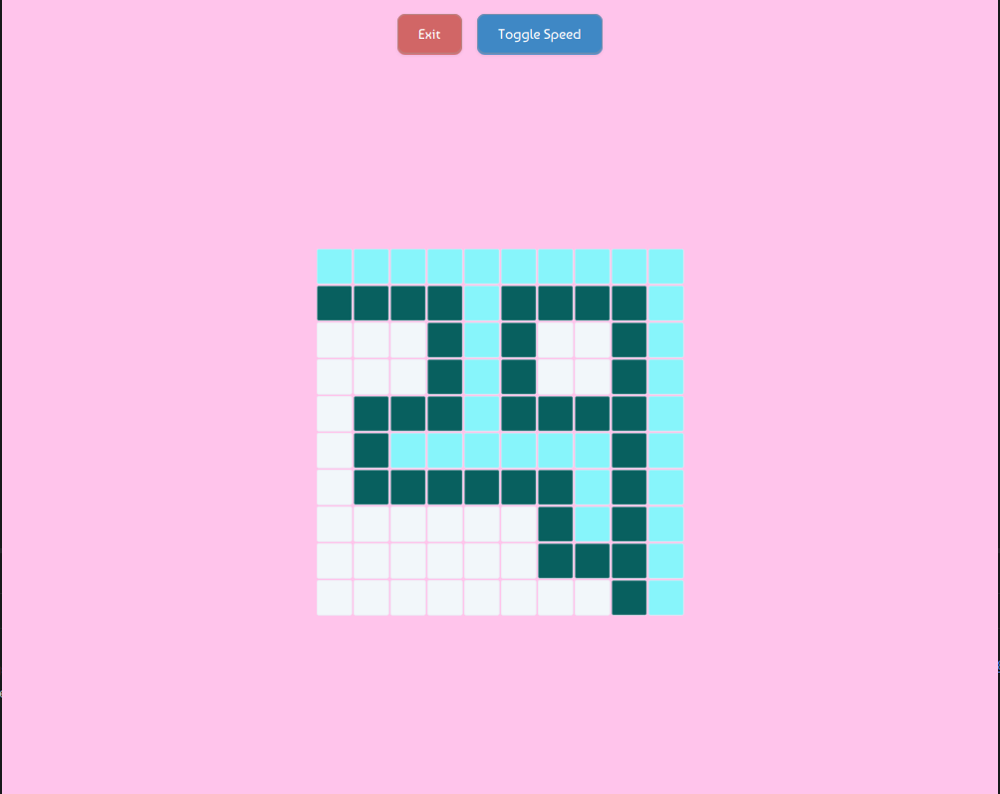
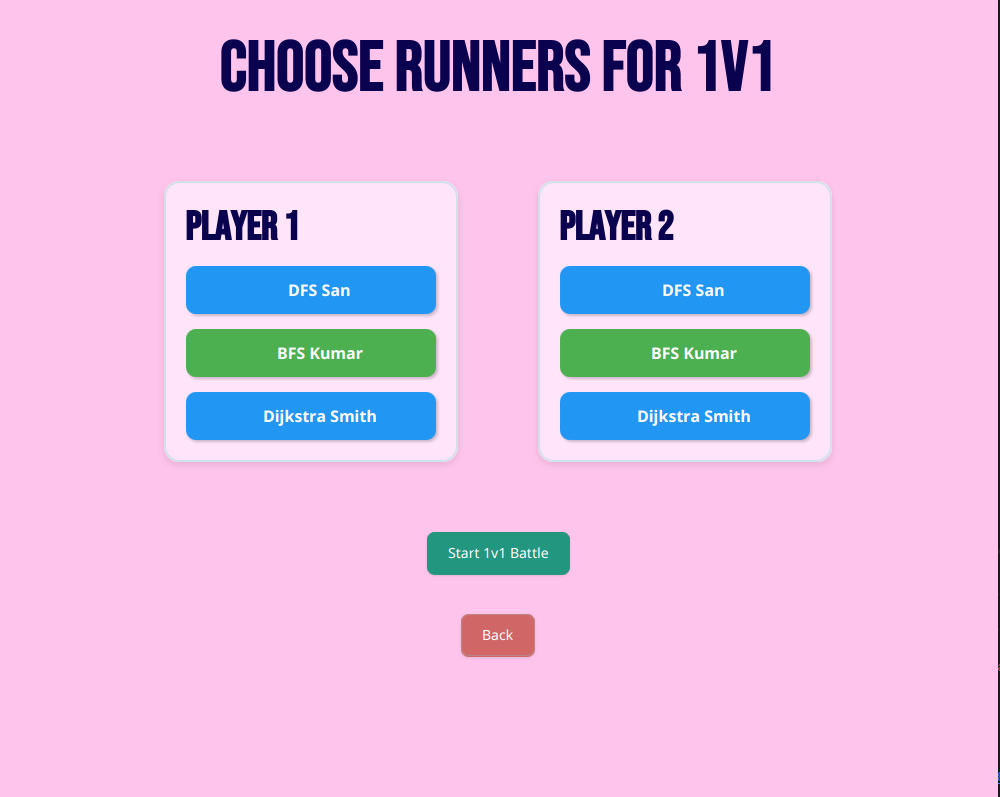
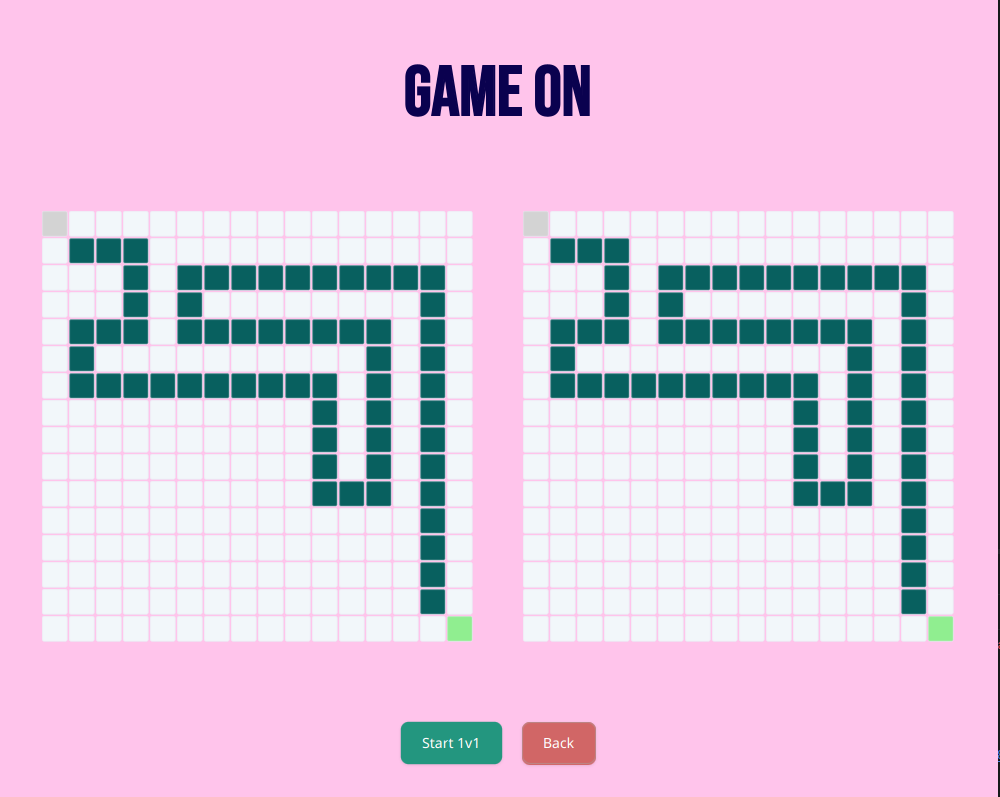

# 🏃‍♂️ Maze Runner

<div align="center">

### Visualize • Compare • Benchmark Pathfinding Algorithms

A JavaFX-based pathfinding algorithm visualization platform that allows users to explore graph traversal algorithms, compare their behavior side-by-side, and benchmark custom implementations against built-in solutions.

Built as a combination of algorithm visualization, performance analysis, and software engineering principles.

</div>

---

# 📸 Screenshots

## Home Screen

The main entry point of the application.

* Start Single Player Mode
* View Leaderboard Rankings
* Configure Settings
* Exit Application



---

## Game Mode Selection

Choose how you want to explore the algorithms.

### Available Modes

* Normal Mode
* 1v1 Comparison Mode
* Create Your Own Runner



---

## Difficulty Selection

Select from predefined maze difficulties.

### Available Difficulties

* Easy
* Medium
* Hard

All maze layouts are loaded from JSON files to ensure consistent benchmarking and reproducible results.



---

## Algorithm Selection

Choose the algorithm that will solve the maze.

### Available Runners

* DFS Runner
* BFS Runner
* Dijkstra Runner



---

## Maze Visualization

Watch algorithms solve the maze in real time.

Features:

* Animated traversal
* Path discovery visualization
* Adjustable speed controls
* Interactive execution



---

## 1v1 Algorithm Battle

Compare two algorithms simultaneously on the exact same maze.

Observe:

* Traversal patterns
* Exploration behavior
* Solution efficiency
* Performance differences



---

## Side-by-Side Visualization

Two algorithms solving the same maze simultaneously.

Perfect for understanding the strengths and weaknesses of different traversal strategies.



---

# ✨ Features

## 🧠 Pathfinding Algorithm Visualization

Currently implemented algorithms:

* Depth First Search (DFS)
* Breadth First Search (BFS)
* Dijkstra's Algorithm

Every algorithm is visualized step-by-step to demonstrate how it explores and solves a maze.

---

## ⚔️ 1v1 Comparison Mode

Run two algorithms simultaneously.

Compare:

* Search patterns
* Node exploration order
* Completion speed
* Path quality

This mode provides a direct visual comparison between different graph traversal strategies.

---

## 🏗️ Custom Runner System

Maze Runner supports user-created algorithms.

Any algorithm implementing the `Runner` interface can participate in benchmarking and leaderboard rankings.

```java
package Backend;

import java.util.List;

public interface Runner {
    List<int[]> run(int[][] maze);
}
```

### Input

```java
int[][] maze
```

Maze represented as a 2D grid.

### Output

```java
List<int[]>
```

Path generated by the algorithm.

This architecture allows developers to create and test their own pathfinding strategies without modifying the core application.

---

## 📊 Benchmarking Engine

A dedicated benchmarking module measures algorithm performance.

### Benchmark Procedure

1. Load predefined maze.
2. Execute algorithm 1000 times.
3. Measure execution duration.
4. Calculate average runtime.
5. Update leaderboard rankings.

This ensures fair and consistent performance comparisons.

---

## 🏆 JSON-Based Leaderboard

Leaderboard rankings are persisted using JSON.

Tracks:

* Algorithm Name
* Average Runtime
* Relative Ranking

Built-in and custom algorithms compete under identical conditions.

---

## 🗺️ Maze System

### Storage

All maze configurations are stored in:

```text
mazes.json
```

### Current Configuration

* 3 predefined mazes
* Multiple difficulty levels
* Consistent benchmark environment

### Internal Representation

```java
int[][] maze
```

The grid structure acts as the graph explored by the pathfinding algorithms.

---

# 🏗️ Project Architecture

```text
src/main/java
│
├── Backend
│   ├── Runners
│   ├── Structures
│   ├── UserCreated
│   ├── BenchmarkRunner
│   ├── DynamicRunnerLoader
│   ├── GridGenerator
│   ├── MazeGenerator
│   ├── UserCodeWrapper
│   ├── Runner
│   └── LeaderboardEntry
│
├── Frontend
│   ├── AnimationEngine
│   ├── GameScreen
│   ├── GameScreen1v1
│   ├── LeaderboardScreen
│   ├── RunnerSelectionScreen
│   ├── SceneManager
│   ├── StatScreen
│   └── Main
│
└── Resources
```

---

# 🔧 Technologies Used

## Core

* Java 21
* JavaFX

## Data Storage

* JSON

## Concepts

* Graph Theory
* Pathfinding Algorithms
* Benchmarking
* Object-Oriented Programming
* Interface-Based Design
* Dynamic Class Loading
* Data Persistence

---

# 🎯 Algorithms Included

| Algorithm | Type                    | Guarantees Shortest Path |
| --------- | ----------------------- | ------------------------ |
| DFS       | Depth-Based Traversal   | ❌                        |
| BFS       | Breadth-Based Traversal | ✅                        |
| Dijkstra  | Weighted Shortest Path  | ✅                        |

---

# 🚀 Running the Project

## Clone Repository

```bash
git clone https://github.com/yourusername/MazeRunner.git
```

## Navigate

```bash
cd MazeRunner
```

## Run

```bash
mvn javafx:run
```

---

# 📚 What I Learned

Through this project I explored:

* Graph traversal algorithms
* Algorithm benchmarking
* JavaFX application architecture
* Dynamic algorithm loading
* Interface-driven design
* JSON persistence
* Performance measurement techniques

---

# 🔮 Future Improvements

* A* Search Algorithm
* Random Maze Generation
* Maze Editor
* Algorithm Statistics Dashboard
* Export Benchmark Reports
* Additional Graph Algorithms
* Replay System
* Custom Visualization Themes

---

# ⭐ Key Highlights

* Implemented DFS, BFS, and Dijkstra pathfinding algorithms.
* Built a reusable Runner interface for custom algorithm integration.
* Created a dynamic algorithm loading system.
* Developed a benchmarking framework executing algorithms 1000 times for accurate comparisons.
* Designed a JSON-based leaderboard persistence system.
* Implemented side-by-side algorithm comparison mode.
* Built an animated JavaFX visualization engine.

---

# 👨‍💻 Author

**Sahil Balyan**

Java Developer | Spring Boot Enthusiast | Problem Solver

Focused on building applications that combine software engineering principles with algorithmic thinking and performance analysis.
